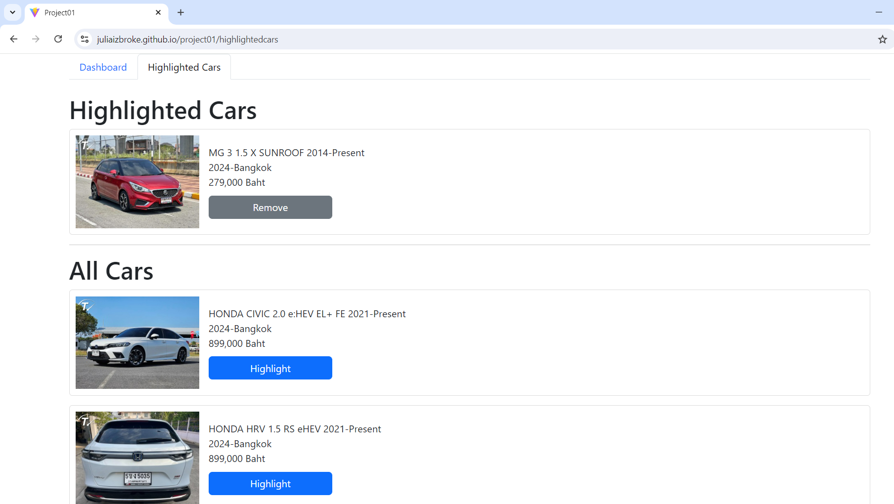

# project01 - Car Analytics Dashboard

## Table of Contents
- [Introduction](#introduction)
- [Features & Screenshots](#features-&-screenshots)
- [Usage](#usage)
- [Technologies Used](#technologies-used)
- [Project Members](#project-members)

## Introduction
**Car Analytics Dashboard** is a web application designed for market owners to monitor and manage their car inventory. The application provides a user-friendly interface to view car statistics, highlight specific cars, and analyze inventory data through visualizations such as pie charts and stacked bar charts.

## Features & Screenshots
- **Dashboard Page**: 
  - View the number of cars and their total values by brand and model.
  - Visualize the distribution of cars by brand using a pie chart.
  - Analyze car models of a specific brand using a stacked bar chart.
    
    
    
    
  
- **Highlighted Cars Page**:
  - Highlight specific cars to keep track of them separately.
  - Remove cars from the highlighted list.
  - Persistent storage of highlighted cars, ensuring the selection is retained even after reloading the page.
    

## Usage
- **Accessing the Dashboard**
  - On the landing page, you’ll be directed to the Dashboard, where you can view car statistics by brand and model.
- **Highlighting Cars**
  - Navigate to the "Highlighted Cars" tab to manage your highlighted cars. Add cars from the list and manage your highlights easily.
- **Persistent Storage**
  - Any cars you highlight will persist even if you reload the page, allowing you to keep track of important cars over time.

## Technologies Used
- **React**: JavaScript library for building user interfaces.
- **React Bootstrap**: CSS framework for responsive design.
- **React Router**: Library for routing in React applications.
- **Chart.js**: JavaScript library for creating charts.
- **JSON**: Data format used for car data storage.

## Project Members
- **CSX4107-WAD Sec542**
- **6530203 - Khant Min Lwin**
- **6530207 - Zwe La Pyae**
- **6530213 - Thet Myat Noe Thwin**